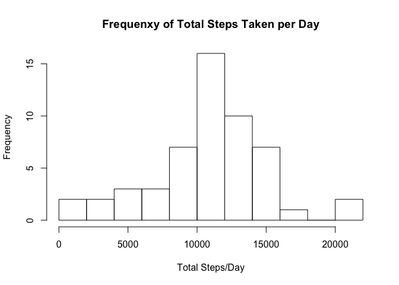
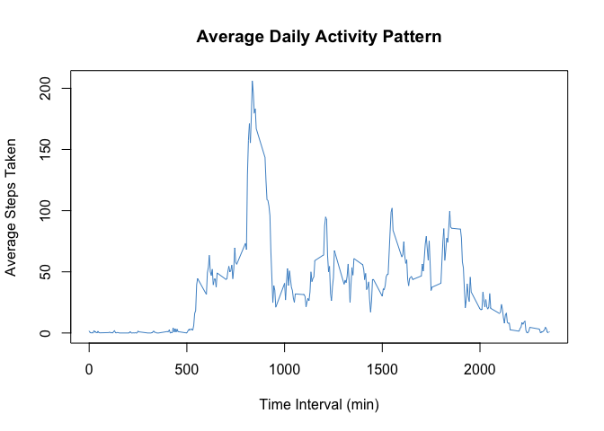
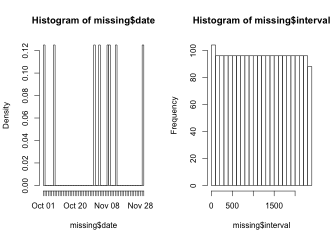
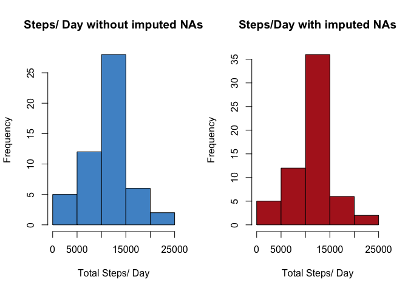
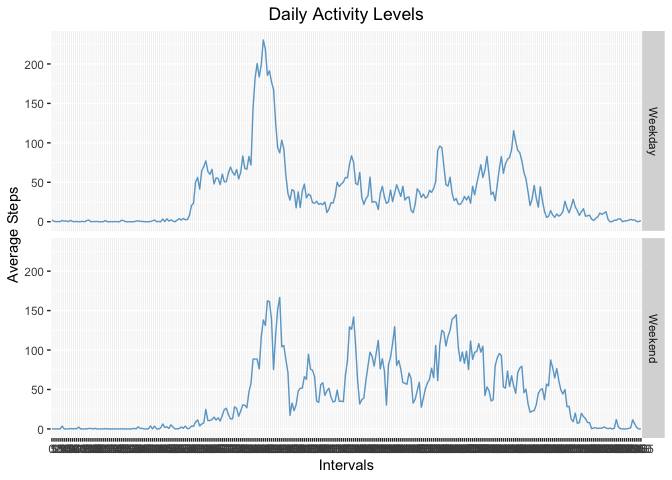

## Loading and preprocessing the data

Load data using read.csv() and set appropraite column classes.

```r
unzip("activity.zip")
act <- read.csv("activity.csv", colClasses = c("integer", "Date", "factor"))
```

## What is mean total number of steps taken per day?

Load package "dplyr".  Find total steps taken per day by first grouping the dataset by date, then using the sum() function to calulate total steps.

```r
library(dplyr)

act1 <- act %>%
        group_by(date) %>%
        summarise(steps_day = sum(steps))
```

Create  a histogram containing total number of steps taken per day.

```r
hist(act1$steps_day, 
     breaks = 15, 
     xlab = "Total Steps/Day", 
     main = "Frequenxy of Total Steps Taken per Day")
```

<!-- -->

Calculate mean and median of total number of steps taken per day.

```r
data.frame(mean = mean(act1$steps_day, na.rm = TRUE), median = median(act1$steps_day, na.rm = TRUE))
```

```
##       mean median
## 1 10766.19  10765
```


## What is the average daily activity pattern?
Average number of steps taken for each 5 minute interval using summarise function and grouping by interval.  


```r
act$interval <- as.integer(as.character(act$interval))
act2 <- act %>%
        group_by(interval) %>%
        summarize(total = mean(steps, na.rm = TRUE))

with(act2, plot(interval, total, type = "l", 
                col = "steelblue3", 
                main = "Average Daily Activity Pattern",
                xlab = "Time Interval (min)",
                ylab = "Average Steps Taken"))
```

<!-- -->

Find which 5-minute interval contains maximum number of steps using max() function, then index to find corresponding maximum interval value.


```r
max_steps <- max(act2$total)
max_interval<- act2$interval[which(act2$total == max_steps)]
max_steps <- round(max_steps, digits = 2)
```

Max average steps: 206.17

Interval with max average steps: 835

## Imputing missing values

###1. Calculate and report the total number of missing values in the dataset (i.e. the total number of rows with NAs)


```r
table(is.na(act))
```

```
## 
## FALSE  TRUE 
## 50400  2304
```

###2. Devise a strategy for filling in all of the missing values in the dataset. The strategy does not need to be sophisticated. For example, you could use the mean/median for that day, or the mean for that 5-minute interval, etc.

Visualize missing values for each variable to look for potential patterns in missing values.


```r
missing <- subset(act, is.na(steps))
par(mfrow = c(1,2))
hist(missing$date, breaks = 50)
hist(missing$interval, breaks = 30)
```

<!-- -->

NAs are evenly dispered among intervals but appear to only exist for certain dates.  Focus on replacing missing values by for each interval .  The missing values will be replaced with mean of their respective interval.

### 3. Create a new dataset that is equal to the original dataset but with the missing data filled in.

To begin, mean must be calculated for each interval using tapply() function.


```r
act$interval <- as.factor(act$interval)
int_mean <- tapply(act$steps, act$interval, mean, na.rm = TRUE)
```

Next, split the data set into missing and non-missing values.


```r
with_NA <- act[is.na(act$steps), ]
without_NA <- act[!is.na(act$steps), ]
```

Replace missing data subset (with_NA) values with previously calculated interval means (int_mean). Begin by replacing steps from NA subset with intervals (as factor variable).  Then, replace levels of this new factor variable with previously calculated interval means.


```r
with_NA$steps <- with_NA$interval
levels(with_NA$steps) <- int_mean
```

Combine non NA subset with new imputed subset to produce a data frame equal in size to the original data frame, but with imputed NA values.


```r
imputed_act <- rbind(without_NA, with_NA)
```

### 4. Make a histogram of the total number of steps taken each day and Calculate and report the mean and median total number of steps taken per day. Do these values differ from the estimates from the first part of the assignment? What is the impact of imputing missing data on the estimates of the total daily number of steps?

Make histograms for original and imputed datasets showing total number of steps per day.  Start by calculating total steps per day, then plot results.


```r
imputed_act$steps <- as.integer(imputed_act$steps)

original_steps <- aggregate(steps ~ date, data = act, FUN = sum, na.rm = TRUE)
imputed_steps <- aggregate(steps ~ date, data = imputed_act, FUN = sum, na.rm = TRUE)

par(mfrow = c(1,2))

hist(original_steps$steps, 
     col = "steelblue3",
     main = "Steps/ Day without imputed NAs",
     xlab = "Total Steps/ Day")

hist(imputed_steps$steps,
     col = "firebrick",
     main = "Steps/Day with imputed NAs",
     xlab = "Total Steps/ Day")
```

<!-- -->

Calculate mean and median for original and imputed datasets to compare difference in values.


```r
mean_act <- (mean(original_steps$steps, na.rm = TRUE))
mean_act <- format(mean_act, digits = 1)
median_act <- median(original_steps$steps, na.rm = TRUE)

mean_imp <- mean(imputed_steps$steps, na.rm = TRUE)
mean_imp <- format(mean_imp, digits = 1)
median_act <- median(imputed_steps$steps, na.rm = TRUE)
```

Mean total steps/ day from the original dataset (w/ NA values) is 10766, and median is 10641, while mean total steps/day from the dataset with imputed NA values is 10750, and median is 10641.

These results show little effect to mean and median when NA values are imputed.

## Are there differences in activity patterns between weekdays and weekends?

### 1. Create a new factor variable in the dataset with two levels – “weekday” and “weekend” indicating whether a given date is a weekday or weekend day. Make a panel plot containing a time series plot (i.e. type = "l") of the 5-minute interval (x-axis) and the average number of steps taken, averaged across all weekday days or weekend days (y-axis). The plot should look something like the following, which was created using simulated data:


Convert dates to weekdays using weekdays() function (date variable changes class from 'date' to 'character').  Create new variable indicating whether dateis a weekday or weekend using ifelse() function with logical parameters.  Transform the new variable into class 'factor'.


```r
imputed_act$date <- weekdays(imputed_act$date, abbreviate = TRUE)
imputed_act$wktype <- ifelse(imputed_act$date == "Sat" | imputed_act$date == "Sun", "Weekend", "Weekday")
imputed_act$wktype <- as.factor(imputed_act$wktype)
```

Next, determine daily activity levels by calculating mean steps per interval using summarize() and grouping by weekday type and interval.


```r
wkday <- imputed_act %>%
                group_by(wktype, interval) %>%
                summarize(avg_steps = mean(steps, na.rm = TRUE))
```

Finally, plot the results of daily activity levels for weekdays vs. weekends using ggplot2.  


```r
library(ggplot2)
g <- ggplot(wkday, aes(interval, avg_steps, group = wktype))
g + geom_line(col = "skyblue3") + 
        facet_grid(wktype ~. ) + 
        labs(title = "Daily Activity Levels", x = "Intervals", y = "Average Steps") + 
        theme(plot.title = element_text(hjust = 0.5))
```

<!-- -->


